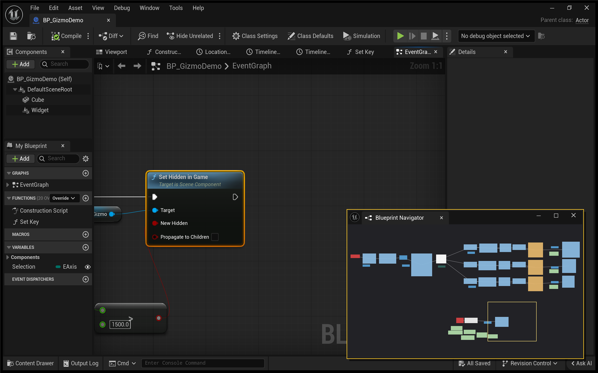
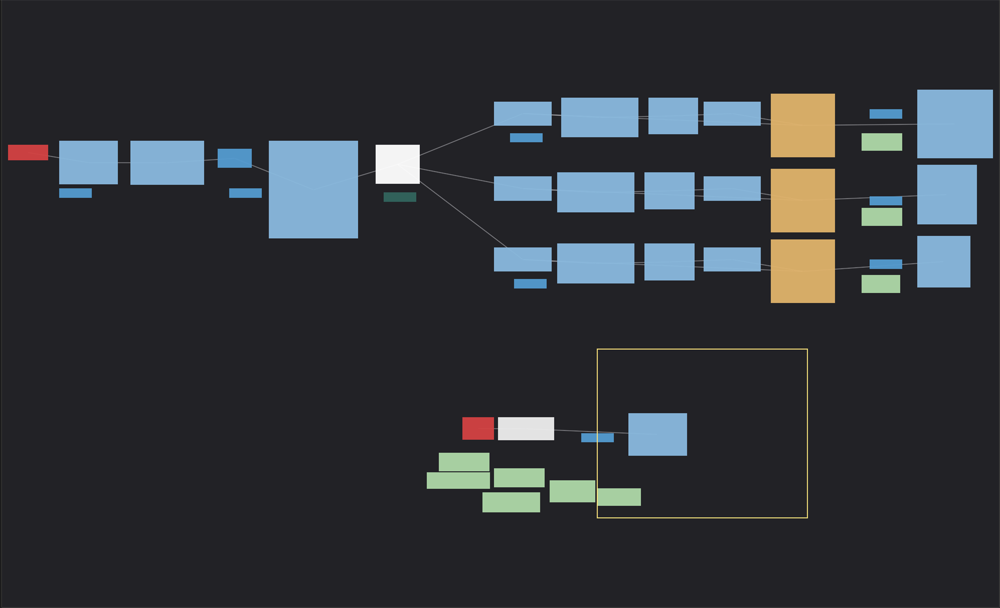

# Blueprint Navigator

Keep your place in a large Blueprint graph. Blueprint Navigator adds a dockable
minimap; click a node on the map to select and frame it in the editor.

[View on Fab](https://www.fab.com/listings/3cb0ec86-2f86-4c88-9eee-29f81e395e1d) | [Navigation walkthrough](docs/navigation-guide.md)

Documentation for the Fab plugin. Support: **money007t@gmail.com**

---

## Requirements

| | |
|---|---|
| Engine | Unreal Engine 5.8 |
| Editor platform | Windows |
| Project type | Blueprint-only and C++ projects both work |
| Graph types | Blueprint and Widget Blueprint |

## Installing

### From Fab

1. Open the Epic Games Launcher, go to **Unreal Engine → Library → Fab Library**.
2. Find **Blueprint Navigator** and click **Install to Engine**, then pick 5.8.
3. Restart the editor.
4. Check **Edit → Plugins**, search `Blueprint Navigator`, and make sure **Enabled**
   is ticked. Restart if the editor asks you to.

Installing from Fab gives you a precompiled build, so a Blueprint-only project needs
no compiler.

### From the source zip

1. Unzip into your project so the layout is
   `<YourProject>/Plugins/BPNavigator/BPNavigator.uplugin`.
2. Reopen the project. The editor offers to build the plugin; say yes.

Building from source needs a C++ toolchain (Visual Studio 2022 with the *Game
development with C++* workload). If you have a Blueprint-only project and no compiler
installed, use the Fab install instead.

## Opening the panel

**Window → Developer Tools → Blueprint Navigator**

Or type `BPNav.Open` into the editor console — the `~` key, or the **Cmd** box at the
bottom of the Output Log.

The panel is a nomad tab. Dock it wherever you like; it stays there in your saved
layout.

## Using it

Open any Blueprint. The panel follows whichever Blueprint graph you last worked in.

| Action | Result |
|---|---|
| Click a node on the map | Selects it and frames it in the graph |
| Click empty map space | Scrubs the graph view there |
| Drag on the map | Scrubs continuously |

The **amber rectangle** is your current viewport, and it tracks in real time as you
pan and zoom. Pan far off the nodes and the rectangle pins itself to the edge of the
panel, pointing the way back.

## What the map draws

- **Every node at its real position**, in the colour Unreal already gives it, so the
  map looks like the thing it maps.
- **Execution wires**, so branches and merges are readable at a glance.
- **Comment boxes as backdrops** behind the nodes.

Node positions and sizes come from the live graph panel, not from an estimate, so the
map matches what the graph editor is actually rendering.

## What it does not do

The plugin changes editor view position and selection. It does not provide operations to add, delete, move or reconnect graph nodes. Keep your usual project backups and report any unexpected behavior.

**Network behavior.** No telemetry, no analytics, no licence check, no
update ping. It collects no data about you or your project.

**It ships nothing in your game.** The module is editor-only, so it adds nothing to a
packaged build.

## Limitations

- **Animation Blueprint graphs are not supported.** Their editor toolkit lives in a
  private engine header, and reaching it would mean an unsafe cast that could crash
  your editor. Better to ship without the feature than ship that.
- **Execution wires only, not data wires.** Data pins roughly triple the line count
  and turn the map into hair. Control flow is what you navigate by.
- **Windows only** in 1.0.0. macOS, Linux and earlier engine versions are not verified for this release. Request the version you need through support; no release date is promised.

## Troubleshooting

**The Window menu has no Blueprint Navigator entry.**
The plugin is not enabled. Edit → Plugins, search `Blueprint Navigator`, tick
Enabled, restart the editor.

**The panel says "Open a Blueprint to see its graph".**
No Blueprint editor is open. Open one from the Content Browser.

**The panel says "Open a graph tab".**
A Blueprint is open, but no graph tab is focused. Click the Event Graph tab, then click inside the graph.

**The panel is empty even though a graph is open.**
Click once inside the graph to give it focus. The panel follows the most recently
used Blueprint editor.

**The map looks tiny in a corner.**
That happens when one node sits far away from the rest — a stray node dragged
thousands of units out. Find it on the map, click it to jump there, and move it back.

## FAQ

**Does it modify my Blueprints?** No. See *What it does not do* above.

**Does it slow the editor down?** The source refresh interval is 0.1 seconds. Cost depends on graph size, graph layout and editor workload; no measured performance guarantee is available. Compare your own editor workload with the panel open and closed.

**Does it work on Widget Blueprints?** Yes.

**Does it work on Animation Blueprints?** No — see *Limitations*.

**Can I see data wires too?** Not in 1.0.0.

**Does it work on UE 5.7 or earlier?** It is built and tested against 5.8 only.

## Example project

A small Blueprint-only project with a deliberately oversized Event Graph, for trying
the panel out on something big:

**[Download the example project](https://github.com/Rgupta100/blueprint-navigator/releases/latest)**

It expects Blueprint Navigator to already be installed — the example does not include
the plugin itself.

## Changelog

### 1.0.0

Initial release. Blueprint and Widget Blueprint graphs, execution wires, comment
backdrops, live viewport rectangle, click-to-jump, drag-to-scrub.

## Support

Bug reports and feature requests: **money007t@gmail.com**, or open an issue on this
repository. Response target is 48 hours on weekdays.
