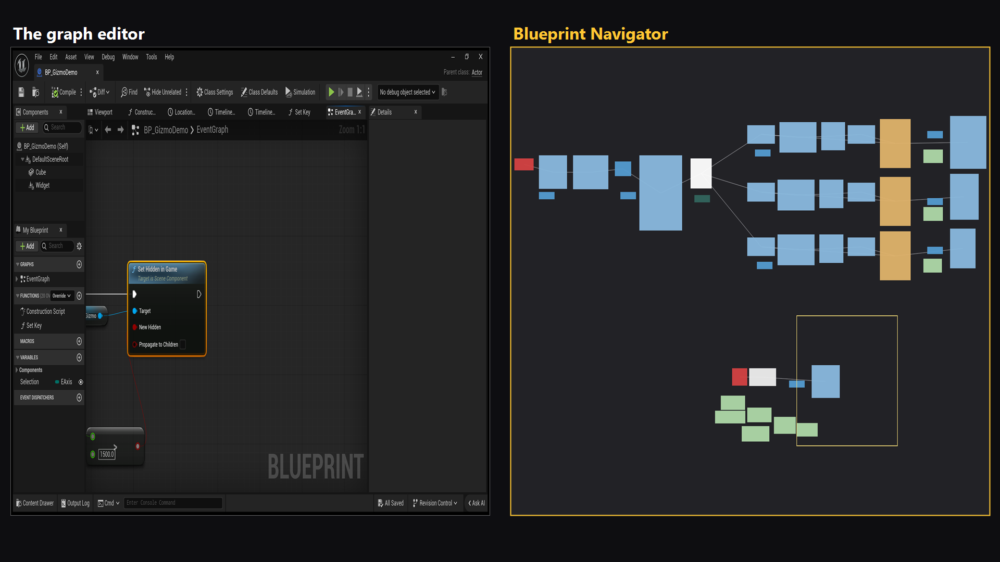
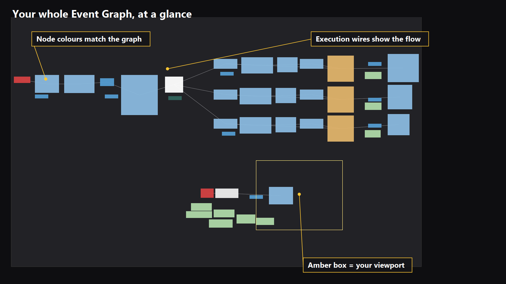

# Keep your place in a large Blueprint graph

When a graph extends beyond the editor window, zooming out gives you context but makes individual nodes harder to read. Blueprint Navigator keeps the overview in a separate docked panel while you work close up.

This guide uses the Blueprint Navigator 1.0.0 example shown in the product screenshots. It is a screenshot walkthrough, not a timed comparison or a recording of a new editor session.

## Open a map beside your graph

Use Unreal Engine 5.8 on Windows with the plugin installed and enabled. Open a Blueprint's Event Graph, then open **Window > Developer Tools > Blueprint Navigator**. The console command `BPNav.Open` opens the same panel. Dock it beside the graph and click inside the graph to focus it.

The amber rectangle shows the part of the graph currently in view. The rest of the map gives you spatial context without changing your working zoom just to inspect the layout.

## Return to a distant cluster

Identify the cluster by its position, comment backdrop or execution connections. Click a node on the minimap to select and frame that node in the graph editor. To move through a region without choosing a node, drag across empty map space.

If you have panned into empty space, the viewport indicator stays at the panel edge. Use the map to return to the visible graph. A graph with a stray node far from the other nodes may look small in the overview; inspect that outlier before deciding to move it yourself.

## When the map is blank

Confirm that the plugin is enabled and a supported Blueprint or Widget Blueprint graph is open. Click the Event Graph tab, then click inside the graph. Animation Blueprints are outside this release's supported scope.

The map draws execution wires, not data wires. It doesn't search node text or reorganize the graph. Node selection and view movement are the supported navigation actions.

## Try the same task in your own project

Choose a named node in a distant comment region. Start at the same view position for each attempt; find the target with your normal navigation workflow, then with the minimap. Alternate the order on later attempts because remembering the target affects the result. Record engine version, graph size and editor workload if you share timing observations.

No comparison timings have been collected for this guide.

[Installation and requirements](../README.md) · [Example project](https://github.com/Rgupta100/blueprint-navigator/releases) · [View Blueprint Navigator on Fab](https://www.fab.com/listings/3cb0ec86-2f86-4c88-9eee-29f81e395e1d)
